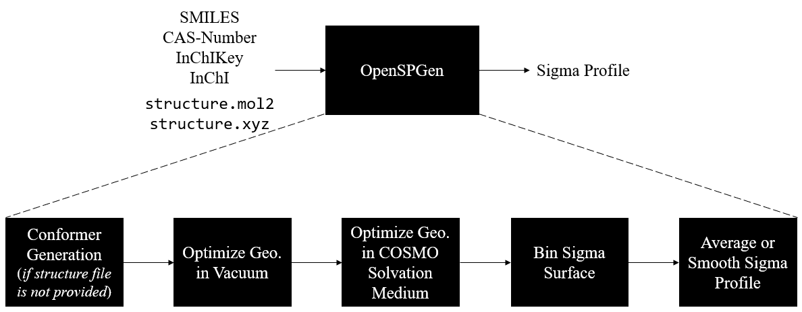

# SPG
An open source sigma profile generator.



The pre-print associated with this work is available on ChemRxiv: [Open-Source Generation of Sigma Profiles: Impact of Quantum Chemistry and Solvation Treatment on Machine Learning Performance](https://chemrxiv.org/engage/chemrxiv/article-details/67bc9bf6fa469535b9bb872e).

## Installation Instructions
1. Install the open source DFT package `NWChem` without Python support. The version used during the development of this package is `7.2.0-beta2` available for download [here](https://github.com/nwchemgit/nwchem/releases/tag/v7.2.0-beta2)*. Functionality has been tested with later versions (version `7.2.0` to be specific), but consistency of the produced sigma profiles with version `7.2.0-beta2` has not been tested.
2. Add the path of the `nwchem` executable to your `PATH` variable (the `nwchem` executable path should be along the lines of: `User/Desktop/nwchem-7.2.0-beta2/bin/LINUX64`)
3. Download the current repository to your local machine.
4. Create a conda environment where you can install `rdkit` and its dependencies from the provided `yml` file using the following instructions:
   ```
   # Go to the directory where the repository was installed
   cd <SPG-installation-path>
   cd Python
   # Create a conda environment for all the dependencies
   conda env create -n spg-env --file spg.yml
   ```
5. Add the location of the `Python` directory to your device's path variable.
6. Run the installation tests (will run a sigma profile generation job for methane with different inputs - a SMILES, a CAS number and a pre-optimized xyz). *You may need to edit the environment section of the script before running tests.*
   ```
   ./run-tests.sh
   ```

6. To run future jobs, either copy the `Python` folder into your working directory or add the path where it was installed (`<SPG-installation-path>/Python/`) to your `PATH` variable.

*Note: Because the DFT software used in this package is only available for Linux and macOS distributions, the complete tool can only be run and should be installed on those machines. 

## Usage Instructions

The below help message summarizes the required and optional user inputs to run the main script and can be generated by running `./Python/RunRepeats.py --help`.

```
usage: RunRepeats.py [-h] --idtype IDTYPE --id ID [--charge CHARGE] [--initialxyz INITIALXYZ] [--preoptimize PREOPTIMIZE] [--name NAME] [--nslots NSLOTS] [--njobs NJOBS] [--noautoz NOAUTOZ]
                     [--iodine IODINE]

options:
  -h, --help            show this help message and exit
  --idtype IDTYPE       Molecule identifier type. Options: SMILES, CAS-Number, InChI, InChIKey, or mol2 (Not case sensitive, but must include separators like `-`). This argument is required.
  --id ID               Molecule identifier. This argument is required.
  --charge CHARGE       Molecule charge. Default is None and will be calculated later on using `rdkit.Chem.rdmolops`.
  --initialxyz INITIALXYZ
                        Path to initial xyz file for NWChem geometry optimization, if desired. Otherwise, use 'Random' or 'None' for a random conformer.
  --preoptimize PREOPTIMIZE
                        Pre-optimize the molecule using a standard forcefield (MMFF94). Options: True or False. Only available if a `mol2` idtype is provided.
  --name NAME           Tail for the job name. Default is `UNK`.
  --nslots NSLOTS       Number of cores/threads to use for NWChem calculations. Default is 4.
  --njobs NJOBS         Number of repeat jobs to be run. Default is 1.
  --noautoz NOAUTOZ     NWChem setting to disable use of internal coordinates. Default is False.
  --iodine IODINE       The molecule contains an iodine atom. Default is False.
```

An example usage file is provided in `run-sp-job.sh`.

### Additional Usage Notes

- It is not recommended to generate SPs for large molecules or structures with large cycles without a starting initial geometry. All identifier types other than an initial xyz or `mol2` require generating an initial structure from a SMILES string retrieved from PubChem, and the `rdkit.Chem.rdmolfiles.MolFromSmiles()` function is likely to have trouble generating structures with nested cycles.


## Available Data
This repository is associated with a study on the effect of quantum chemistry on the performance of machine learning models to predict thermophysical properties from sigma profiles. The datasets discussed in that work are available in this repository in the `manuscript-databases` folder. These include:

- **Sigma profile databases**: `csv` files including sigma profile databases for 1432 molecules under different levels of theory. The naming indicates the basis set and functional used to generate that dataset (e.g. `sp_functional_basis-set.csv`). 
   - All the sigma profiles in those datasets are unaveraged, except for `sp_mullins_vt-2005.csv`, which contains the sigma profiles published by Mullins (2006)**. These are equivalent to applying the averaging radius of 0.8174 to the unaveraged Mullins dataset `sp_mullins_no_av`.
- **Input geometries**: Starting geometries used in the quantum chemistry studies are in the folder: `manuscript-databases/VT-2005_XYZs`.
- **GP training results**: the folder `manuscript-databases/GP-Training-HF_yk` contains the target property datasets along with GP models pre-trained on the sigma profile dataset with the recommended combination of level of theory and COSMO model (HF/SVP with the YK*** COSMO model). The folder contains:
   - `gpflow-env.yml`: environment file for the packages used to train GP models on already generated sigma profiles.
   - `k-fold-Target-Databases`: thermophysical property databases split into 10 stratified training and testing folds. The datasets labeled `_Original` contain the complete dataset of thermophysical properties.
   - `optimized_models`: GP models pre-trained on the mentioned dataset. Models are labeled a target property code and a k-fold number (e.g. `BP_model_1.pkl` predicts boiling point and was trained on fold #1).
   - `parity_plots`: parity plots for the performance of different trained models.
   - `performance_per_fold`: `csv` files for the performance of different trained models.
   - *Averaged Performances*: `avg_mae.csv`, `avg_R2.csv`, `std_mae.csv`, `std_R2.csv` are the GP performances averaged over the different training folds.
- **Example Usage of Pre-trained GP Model**: the notebook `manuscript-databases/deploy_gp_model.ipynb` shows how to use one of the pre-trained GP models to predict a thermophysical property for a given sigma profile. 
- **Example For Training a GP Model**: the notebook `manuscript-databases/GP-Training-HF_yk/train-gp-model.ipynb` shows how to train a GP model to predict a thermophysical property for a given SP dataset and a specified data split (or k-fold). The script `manuscript-databases/GP-Training-HF_yk/train-gp-model.py` shows the same training example but for multiple target properties and multiple SP datasets for a given k-fold. This is accompanied by a short bash script (`manuscript-databases/GP-Training-HF_yk/train-gp-model.sh`) that shows how it is used to generate the averaged performance results shown in the manuscript.

## References
** Mullins, E.; Oldland, R.; Liu, Y. A.; Wang, S.; Sandler, S. I.; Chen, C.-C.; Zwolak, M.; Seavey, K. C. Sigma-Profile Database for using COSMO-Based thermodynamic methods. *Industrial & Engineering Chemistry Research* **2006**, 45 (12), 4389–4415. https://doi.org/10.1021/ie060370h.

*** York, D. M.; Karplus, M. A Smooth Solvation Potential Based on the Conductor-Like Screening Model. *The Journal of Physical Chemistry A* **1999**, 103 (50), 11060–11079. https://doi.org/10.1021/jp992097l.
